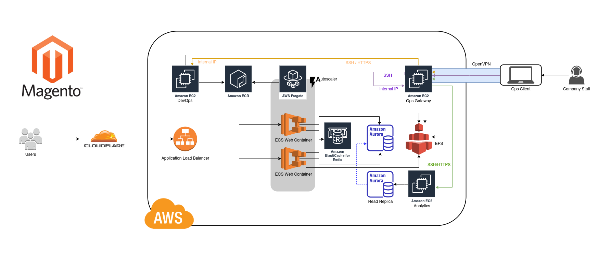

# Dockerized Magento 2 w/ NGINX, REDIS, & Varnish
maintained by: @hkdb


## SUMMARY

A repo to pre-package a Magento 2 instance (w/ NGINX, REDIS, & Varnish) for development and deployment within 5 minutes.

[](readme/m2-arch-dev-v1.jpg)

Targeting production deployments with the below architecture:

[](readme/m2-arch-redacted-v3.jpg)

For more background of where this repo came from, you can read this [blog post](https://hkdb.medium.com/single-command-magento-2-setup-67c041a032d1).

## SUPPORT US!

If this repo was useful to you, feel free to buy us some coffees! :)

[](https://www.buymeacoffee.com/3dfosi)

## DEPENDANCIES

- GNU/Linux, MacOS, Windows w/ WSL
- docker
- docker-compose
- downloaded copy of the latest magento 2 release from [magento.com](https://magento.com/tech-resources/download)

## USAGE

#### You can just use the image that has already been built:

1. Add the FQDN you want pointing to 127.0.0.1 in `/etc/hosts`
   
   ```
   sudo echo -e "127.0.0.1\t<Replace with your own FQDN>" >> /etc/hosts
   ```
2. Clone repository:
   ```
   $ git clone git@ssh.gitlab.mxitech.io:3df/m2-nginx.git
   $ cd m2-nginx
   ```
3. Download Magento from [magento.com](https://magento.com/tech-resources/download) and move to the `web/` directory in the repo
4. Change the `APP_DOMAIN` in test.env to your FQDN
5. Generate SSL cert or drop in your own cert: `cd ssl-test && ./gencert.sh -d <replace with your own FQDN> && cd ..`
5. Bring up the containers and install Magento 2 with REDIS:
   ```
   $ ./up.sh
   ```
A demo of the process is available on YouTube here:

[](https://www.youtube.com/watch?v=LorD8j8BJYE)

#### To stop and remove:

```
$ ./down.sh
```

You may also want to remove the hosts entry:

```
sed -i "s/127.0.0.1\t<Replace with your own FQDN>/g"
```

## PERSISTENT STORAGE

You may want to have persistent storage over multiple docker-compose ups/downs. To accomplish this, you will want to execute the following before running up.sh:

#### m2-web - `/home/magento`:

```
$ mkdir -p <path/to/directory/on/host>
$ docker volume create --driver local --opt type=none --opt device=<path/to/directory/on/host> --opt o=bind m2-web-homedir
```
Uncomment the following in `docker-compose.yml`:

```
#         - m2-web-homedir:/home/magento
```

<br>

#### m2-db - `/var/lib/mysql`:

```
$ mkdir -p <path/to/directory/on/host>
$ docker volume create --driver local --opt type=none --opt device=<path/to/directory/on/host> --opt o=bind m2-db-mysql
```

Uncomment the following in `docker-compose.yml`:

```
#      volumes:
#         - m2-db-mysql:/var/lib/mysql
```

## QUESTIONS, REPORTING ISSUES, & CONTRIBUTIONS

If you are seeing this on GitHub, this is just a mirror. The actual working repo is at [GitLab](https://gitlab.com/hkdb/m2-nginx). If you are already viewing this on GitLab, please continue reading.

For any questions or identified issues with this repo, please submit a ticket at [GitLab](https://gitlab.com/hkdb/m2-nginx/-/issues). However, before you do so, I ask that you read through the rest of this README to ensure that what's documented doesn't already solve your problem.

If you would like to contribute to this project, please make sure you are doing it with the [GitLab repo](https://gitlab.com/hkdb/m2-nginx).

## CONTAINERS SPECIFICS

This automated installation brings up 3 containers. One each for web, database, and redis respectively with the following specifics.

Web Container:

- NGINX w/ Magento configs
- PHP packages and Magento configs
- Creates /home/magento and unzips magento code base
- Creates magento user
- Makes bash the default shell of magento user
- Sets magento permissions for /home/magento
- Sets default environment variables
- Elasticsearch 7 with default config
- Custom base install script
- entry-point.sh script
- stunnel4 with redis config to support TLS
- OPTIONAL: Varnish installation and configuration for Varnish in Web container

Database Container:

- Ubuntu base image with MySQL installed
- MySQL set to listen on 0.0.0.0

Redis Container:

- redis:6.0-buster base image with custom redis.conf

Varnish Container:

- Ubuntu 20.04 base image
- NGINX w/ Varnish config
- Stock Varnish with custom Magento configs
- stunnel4 for full end-to-end encryption from Varnish to Web

## GUIDED INSTALLATION SPECIFICS

The guided/interactive installation installs/configures the following:

- Asks if you want to spin up a standalone Varnish container (If you choose No here, you can still install Varnish inside the Web container if you want to towards the end)
- Launches containers
- Initializes the database with a db named, "magento" and creates a user named, "magento"; granting it access to the magento database. 
- Restarts DB container
- Guided/interactive base install of Magento 2.4.2-p1 (Reads test.env for custom variables like FQDN)
- Disables 2FA due to [this](https://community.magento.com/t5/Installing-Magento-2-x/Magento-2-4-asking-for-twofactor-Authentication-to-login-to/td-p/459910)
- Installs cronjobs
- Configures magento's default, page, and session cache to use REDIS
- Installs/configures Varnish according to the first question

## BUILD YOUR OWN CONTAINERS

1. Download magento 2 from [magento.com](https://magento.com/tech-resources/download)
2. `git clone git@ssh.gitlab.mxitech.io:3df/m2-nginx.git`
3. Move downloaded magento 2 zip file to root of repo
4. `cd web && docker build -t registry.gitlab.com/hkdb/m2-nginx/web:v0.01 .`
5. `cd ../db && docker build -t registry.gitlab.com/hkdb/m2-nginx/db:v0.01 .`

## DEPLOYMENT

In the future, there may be automated scripts that will allow for the users of this repo to deploy directly to AWS with the below target architecture. Until then, it will help a lot if you understood what's under the hood so that you can manually deploy your environment to production or with your tool of choice (ie. Terraform, CloudFormation, etc).

With Varnish ~

[](readme/m2-arch-redacted-v3.jpg)

Without Varnish or Varnish inside Web Container ~

[](readme/m2-arch-redacted-v2.png)

Of course, without Varnish, your dev environment will look like this instead:

[](readme/m2-arch-dev-no-varnish-v1.jpg)

Checklist:

- Change database user password
- Change REDIS password
- Change REDIS TLS to use TLSv1
- Change SSL cert to use Let's Encrypt in production
- Prepare EFS volume for Web Container:
   - /etc/letsencrypt
   - /home/magento/app/etc
   - /home/magento/pub/media
   - /home/magento/var/log
   - /home/magento/var/import
   - /home/magento/var/importexport
   - /home/magento/var/export
   - /home/magento/var/backup
- Prepare EFS volume for Varnish Container:
   - /etc/varnish
- Consider changing stunnel to verify ssl cert for both Web and Varnish

## HISTORY

- 07072021 - Minor README fixes to reflect Github mirroring
- 07072021 - Initial commit

## DISCLAIMER

This repo is sponsored by 3DF OSI and is maintained by volunteers. 3DF Limited, 3DF OSI, and its volunteers in no way make any guarantees. Please use at your own risk!

To Learn more, please visit:

https://osi.3df.io

https://3df.io

